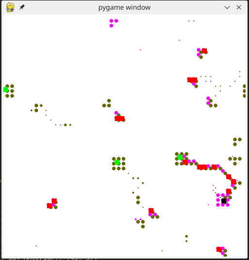
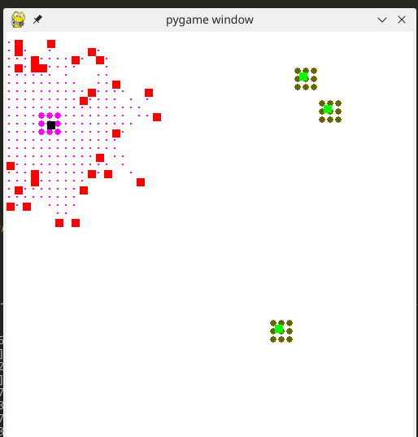
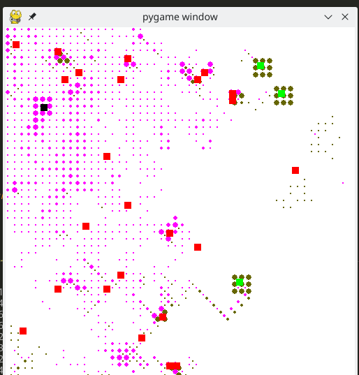

# Simulador Formigueiro

**Disciplina**: FGA0210 - PARADIGMAS DE PROGRAMAÇÃO - T01 <br>
**Nro do Grupo**: 01<br>
**Paradigma**: SMA<br>

## Alunos
|Matrícula | Aluno |
| -- | -- |
| 15/0009011  |  Elias Bernardo |
| 19/0106565  |  Fernando Miranda Calil |
| 15/0008228  |  Daniel Marques Rangel |
| 16/0132550  |  Lorrany dos Santos Azevedo |

## Sobre 

  Este projeto se utiliza da linguagem python através da framework PADE para simular a ação de formigas, saindo do formigueiro e procurando aleatoriamente por comida deixando rastros de feromônio, este que pode ser o feromonio_para_ninho se a formiga está a procura de comida ou feromonio_para_comida, se a formiga está carregando comida e procurando o caminho de volta para o formigueiro. 

  Na escolha entre os caminhos possíveis, a formiga terá preferencia por caminhos com o feromônio que aponta para o local que ela está procurando, dentre eles o caminho que tem a maior intensidade do feromônio desejado, se ela não tiver nenhum caminho disponível com o feromônio desejado, ela ira dar preferencia para caminhos que não contem o feromônio indesejado, para diminuir as chances do círculo da morte*.


## Screenshots

Legenda das imagens:

- __Cículo verde__: feromônio "para comida" 
- __Cículo roxo__: feromônio "para casa" 
- __Quadrado verde__: local de comida
- __Quadrado preto__: formigueiro
- __Quadrado vermelho__: formiga





## Instalação 
**Linguagens**: Python (3.8+)<br>
**Tecnologias**: PADE, PyGame<br>

### Passos
* (RECOMENDADO) Criar uma venv para rodar esse projeto.
* (RECOMENDADO) Ativar essa venv.

* Para criar uma venv, execute o comando abaixo:

```
$ python -m venv venv
```
* E depois ative a venv com o comando (pode variar de acordo com o sistema operacional)

```
$ source venv/bin/activate 
```

> Se tudo deu certo, a palavra (venv) deve aparecer no seu terminal

* Instale os pacotes necessários para rodar o projeto:

```
$ pip install -r requirements.txt --user
```

* Digite esse comando abaixo no terminal:
```
$ pade create-pade-db && pade start-runtime --config_file pade_config.json
```

## Uso 
Explique como usar seu projeto, caso haja algum passo a passo após o comando de execução.

## Vídeo

O vídeo se encontra na raiz do repositório, com o nome `video.mp4`

## Outros 

O comportamento das formigas segue algumas regras pré-estabelecidas: 

- Uma formiga que está __procurando alimentos__ SEMPRE irá preferir um caminho com o feromônio "para comida". Caso não haja esse feromônio em volta dela, ela vai evitar o feromônio "para casa", andando aleatoriamente até encontrar a comida. Caso haja somente o feromônio "para casa" em volta dela, ela irá preferir o caminho com menor intensidade de feromônio.
- Uma formiga que está __carregando um alimento__ SEMPRE irá preferir um caminho com o feromônio "para casa", evitando caminhos com o feromônio "para comida".

Conforme desenvolvemos o projeto, conseguimos observar alguns comportamentos, sendo dois bem interessantes:

### Formação de caminhos 

As formigas naturalmente formam caminhos do formigueiro até a comida, e vice-versa, seguindo os respectivos feromônios. 

### Círculos da morte

Também chamado de "Ant mill", ocorre quando as formigas perdem o rastro do feromônio para o formigueiro, e passam a seguir outras formigas também perdidas. Isso cria um círculo, onde eventualmente as formigas irão morrer de exaustão.

## Fontes

- [Ants simulation](https://www.youtube.com/watch?v=81GQNPJip2Y)
- [https://en.wikipedia.org/wiki/Ant_mill](https://en.wikipedia.org/wiki/Ant_mill)
